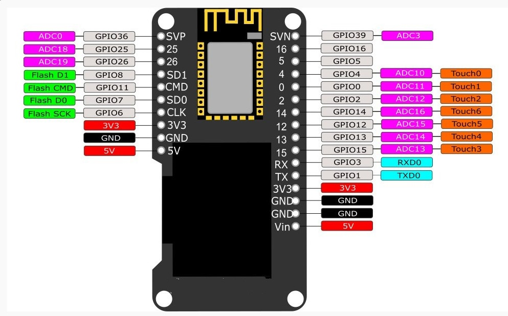
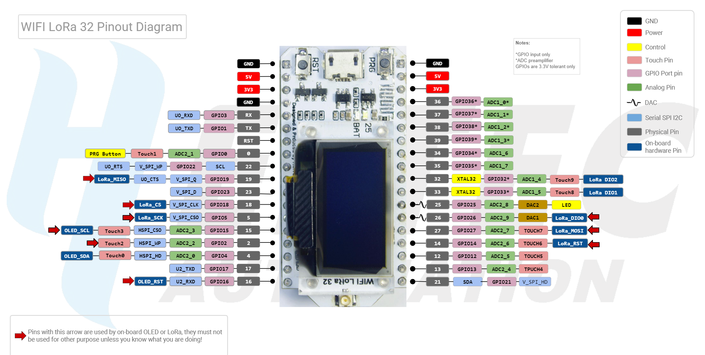

# Dave's Garage
# Episode 4
## Add FastLED
## Add Wemos LOLIN32 board information
## 
## 

### Need help or have a question? See Dave's Garage on YouTube.

## Contents
- [Development Status](#development-status)
- [Installation Instructions](#installation-instructions)
- [Decoding Exceptions](#decoding-exceptions)
- [Issue/Bug report template](#issuebug-report-template)
- [WEMOS LOLIN32 with OLED Board](#WEMOS-LOLIN32)
- [Heltec WiFi LORA 32 V1](#Heltec-WiFi-LORA-32-V1)

## Development Status

Working at this whole thing.

## Installation Instructions
- Use VS Code and PlatformIO

#### Decoding exceptions

I have no idea how to do this or what they are talking about.

#### Issue/Bug report template

Finally, if you're sure no one else had the issue, it's probably you.

## WEMOS LOLIN32
Board name WEMOS LOLIN32. 
<ul>
    <li>OLED Connections:</li>
        <li>CLOCK 4</li>
        <li>DATA 5</li>
        <li>RESET 16</li>
</ul>

## Heltec WiFi LORA 32 V1
Heltec WiFi LORA 32 V1 – ESP32 with OLED and LORA Board 
To program you need to hold button labeled PRG near coil antenna. 
<ul>
    <li>I2C Connections:</li>
        <li>SCL 22</li>
        <li>SDA 21</li>
    <li>OLED Connections:</li>
        <li>CLOCK 15</li>
        <li>DATA 4</li>
        <li>RESET 16</li>
</ul>

## Hint

Keep at it.